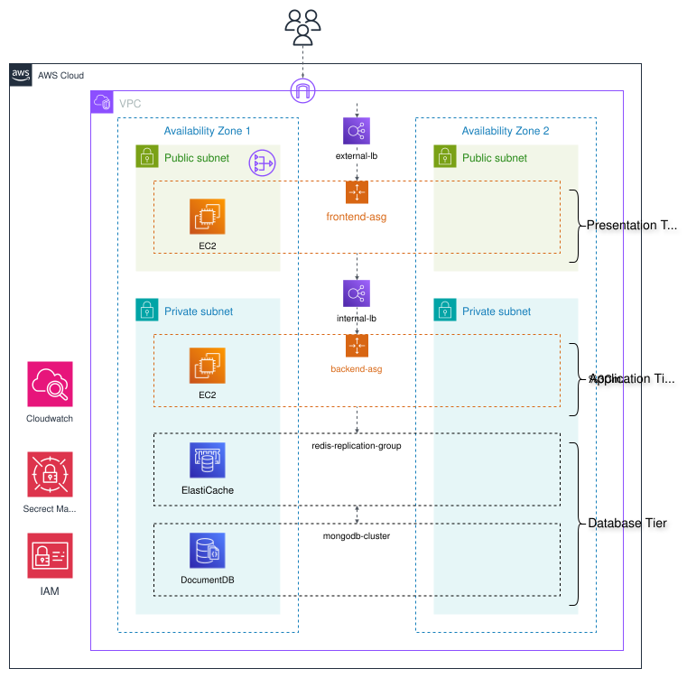

# 3-Tier Architecture

This project implements a 3-tier architecture using AWS, Terraform, and a Python backend.

## Infrastructure Diagram



## Architecture

A classic 3-tier architecture deployed on **AWS** using **Terraform**.

- **Frontend:** Static HTML site served by **Nginx**
- **Backend:** **Flask** REST API written in **Python**, running on **Gunicorn**, using **PyMongo** for database access and **Redis** for caching
- **Data Layer:**
  - **Amazon DocumentDB** (MongoDB-compatible) as the primary datastore
  - **Amazon ElastiCache (Redis)** for in-memory caching


## Project Structure

```
.
├── diagram
└── src
    └── app
    │   ├── backend
    │   └── frontend
    └── aws
        └── modules
            ├── backend
            ├── documentdb
            ├── elasticache
            ├── frontend
            ├── iam
            └── network
```

## Deployment

1.  **Configure AWS Credentials:** Make sure you have your AWS credentials configured properly.
2.  **Initialize Terraform:**
    ```bash
    cd aws
    terraform init
    ```
3.  **Apply Terraform:**

    ```bash
    terraform apply
    ```
4.  **Destroy Infrastructure:**
    ```bash
    terraform destroy
    ```

## API Endpoints

The backend provides the following API endpoints:

*   `GET /system-status`: Returns the status of the system.
*   `GET /get_data/<string:key>`: Retrieves data from the cache or database.
*   `GET /list_all_data`: Retrieves all data from the database.
*   `POST /set_data`: Inserts new data into the database.
*   `DELETE /delete_data/<string:key>`: Deletes data from the database.
*   `GET /health`: Returns the health of the backend and its database connections.

## Other Documentation

*   [AWS Architecture Center](https://aws.amazon.com/architecture/)
*   [Terraform Documentation](https://www.terraform.io/docs)
*   [Flask Documentation](https://flask.palletsprojects.com/)
*   [DocumentDB Documentation](https://aws.amazon.com/documentdb/)
*   [ElastiCache Documentation](https://aws.amazon.com/elasticache/)

## Idea Source

This project is for educational purposes and is based on a common architectural pattern. For more examples and best practices, please refer to the [AWS Architecture Center](https://aws.amazon.com/architecture/).