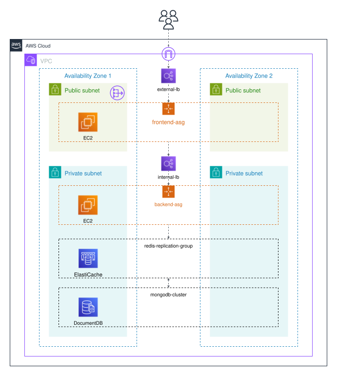

# 3-Tier Architecture

This project implements a 3-tier architecture using AWS, Terraform, and a Python backend.

## Infrastructure Diagram



## Architecture

This project is a classic 3-tier architecture:

*   **Frontend:** A simple static frontend served by Nginx.
*   **Backend:** A Flask application that provides a RESTful API for data manipulation. It uses Gunicorn as a WSGI server.
*   **Database:** 
    *   **DocumentDB:** A MongoDB-compatible database used as the main data store.
    *   **ElastiCache:** A Redis in-memory data store used for caching.

## Technologies Used

*   **Infrastructure:**
    *   AWS
    *   Terraform
*   **Backend:**
    *   Python
    *   Flask
    *   Gunicorn
    *   Pymongo (for DocumentDB)
    *   Redis
*   **Frontend:**
    *   HTML
    *   Nginx

## Project Structure

```
.
├── aws
│   ├── main.tf
│   ├── modules
│   │   ├── backend
│   │   ├── documentdb
│   │   ├── elasticache
│   │   ├── frontend
│   │   └── network
│   └── variables.tf
├── diagram
│   └── 3-tier-architecture.svg
└── src
    ├── app
    │   ├── backend
    │   │   ├── main.py
    │   │   ├── requirements.txt
    │   │   └── ...
    │   └── frontend
    │       └── index.html
    └── ...
```

## Deployment

1.  **Configure AWS Credentials:** Make sure you have your AWS credentials configured properly.
2.  **Initialize Terraform:**
    ```bash
    cd aws
    terraform init
    ```
3.  **Apply Terraform:**

    First, lock in the Availability Zones (AZs) to prevent unexpected resource changes when the number of AZs is modified.    

    ```bash
    terraform apply -target=module.network.random_shuffle.az
    ```

    Once the AZs are selected, you can apply the rest of the infrastructure:

    ```bash
    terraform apply
    ```
4.  **Destroy Infrastructure:**
    ```bash
    terraform destroy
    ```

## API Endpoints

The backend provides the following API endpoints:

*   `GET /system-status`: Returns the status of the system.
*   `GET /get_data/<string:key>`: Retrieves data from the cache or database.
*   `GET /list_all_data`: Retrieves all data from the database.
*   `POST /set_data`: Inserts new data into the database.
*   `DELETE /delete_data/<string:key>`: Deletes data from the database.
*   `GET /health`: Returns the health of the backend and its database connections.

## Other Documentation

*   [AWS Architecture Center](https://aws.amazon.com/architecture/)
*   [Terraform Documentation](https://www.terraform.io/docs)
*   [Flask Documentation](https://flask.palletsprojects.com/)
*   [DocumentDB Documentation](https://aws.amazon.com/documentdb/)
*   [ElastiCache Documentation](https://aws.amazon.com/elasticache/)

## Idea Source

This project is for educational purposes and is based on a common architectural pattern. For more examples and best practices, please refer to the [AWS Architecture Center](https://aws.amazon.com/architecture/).