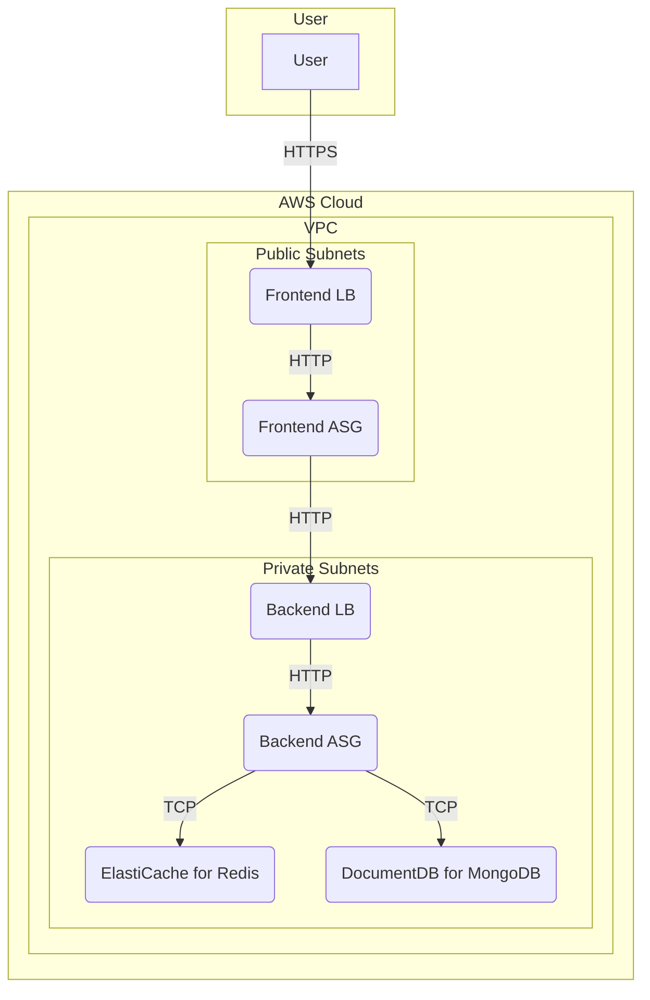

# 3-tier-architecture

### Architecture Diagram

This diagram illustrates the flow of traffic through your three-tier architecture:

```mermaid
graph TD
    subgraph "User"
        direction LR
        user[User]
    end

    subgraph "AWS Cloud"
        subgraph "VPC"
            subgraph "Public Subnets"
                frontend_lb(Frontend LB)
                frontend_asg(Frontend ASG)
            end

            subgraph "Private Subnets"
                backend_lb(Backend LB)
                backend_asg(Backend ASG)
                elasticache(ElastiCache for Redis)
                docdb(DocumentDB for MongoDB)
            end

            user -- HTTPS --> frontend_lb
            frontend_lb -- HTTP --> frontend_asg

            frontend_asg -- HTTP --> backend_lb

            backend_lb -- HTTP --> backend_asg

            backend_asg -- TCP --> elasticache
            backend_asg -- TCP --> docdb
        end
    end
```
